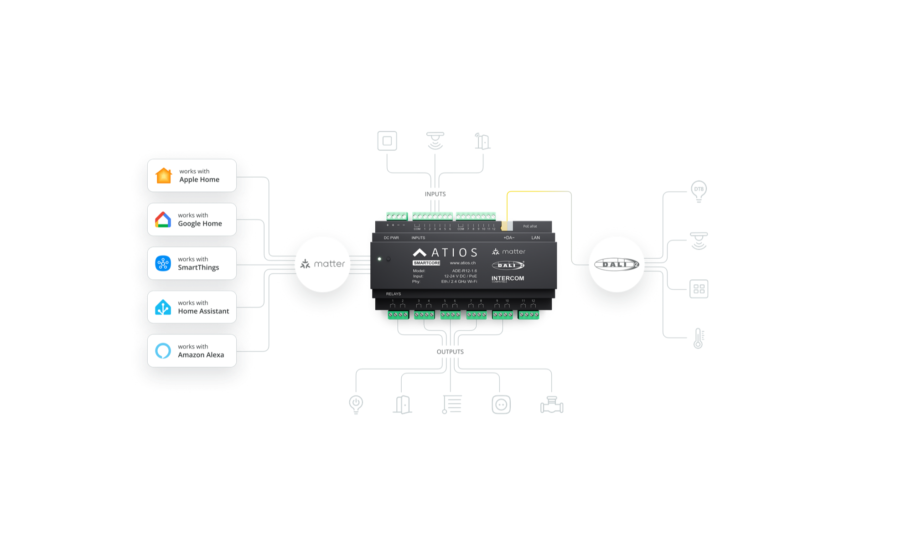

# Atios SmartCore — Home Assistant integration

The [Atios SmartCore](https://atios.ch/products/smartcore) is a **Matter-certified**
DALI-2 controller with **12 binary inputs**, **12 relay outputs** and a **DALI bus**.

## Standard setup — Matter, no integration needed

Because the SmartCore is a certified Matter device, it pairs directly with Home
Assistant. Most users need only this:

1. Visit [setup.atios.ch](https://setup.atios.ch).
2. Create devices in the **Accessory Manager** — e.g. a light bulb from one
   input and one output.
3. DALI devices: scan the bus in the **DALI Configurator** tab.
4. Back in the Accessory Manager, use DALI single addresses or groups as
   outputs, and DALI-2 sensors as inputs — for any device type.
5. Pair the SmartCore with Home Assistant via **Matter**. Every light, blind
   and sensor from the Accessory Manager shows up as its own entity.

Scenes are created in your Matter app (Home Assistant, Apple Home, Google
Home), not in the SmartCore.

## What this repo is for — expert use

This integration gives you **raw DALI access** from Home Assistant: send and
receive arbitrary DALI commands — for example to process live DALI-2 events
from sensors that the SmartCore and its Matter integration do not support yet.

It also provides DALI scene recall, a bus monitor, per-address lights, a
firmware update entity, and the SmartCore web UI as a sidebar panel. Fully
local (push over LAN), no cloud, no external Python dependencies. Works
standalone or alongside a Matter-paired SmartCore.

## Installation

> **Note:** Do **not** add this URL under **Settings → Apps** (the App /
> Add-on store) — that store is for supervisor add-ons only and will reject
> this repository with "not a valid app repository". Use HACS as described
> below.

**Step 1 — Install HACS** (one-time; skip if you already have it in your sidebar)

1. Go to **Settings → Apps → App store**, open the **⋮** menu (top right) →
   **Repositories**, and add `https://github.com/hacs/addons`. Then install
   the **Get HACS** app and press **Start**.
2. Restart Home Assistant (**Settings → System → Restart**).
3. Go to **Settings → Devices & services**, click **Add integration**
   (bottom right), search for **HACS**, and follow the GitHub sign-in
   (a free GitHub account is required — you'll enter a short code at
   github.com/login/device).

**Step 2 — Install the Atios SmartCore integration**

4. Open **HACS** in the sidebar → **⋮** (top right) → **Custom
   repositories** → paste `https://github.com/AtiosAG/homeassistant-smartcore`,
   choose type **Integration**, and click **Add**. Then search for
   **Atios SmartCore** in HACS, click **Download**, and restart Home
   Assistant once more.

   

5. Go to **Settings → Devices & services**, click **Add integration**
   (bottom right), select **Atios SmartCore**, and enter your SmartCore's
   IP address. Done.

   

We plan to submit this integration to the HACS default store, and to Home
Assistant core after that.

### Options

**Settings → Devices & services → Atios SmartCore → Configure**:

- **Sidebar panel** — shows the SmartCore web UI inside Home Assistant. If the
  panel stays blank, the HA log names the exact reason (X-Frame-Options / CSP /
  mixed content).
- **Mode** — **Basic** (default): named per-address lights and the firmware
  update entity. **Advanced**: additionally the bus-wide broadcast light and
  other raw-DALI features. The `atios.send_dali_frame` and
  `atios.recall_scene` services work in either mode.

## Status

| Piece | State |
|---|---|
| DALI frame encode/decode (`dali.py`) | ✅ verified against reference frames (`FF 10` goto-scene, `01 91` query-gear-present) |
| Transport (`hub.py`) | ✅ native aiohttp; HTTP `/api/dali/iface` confirmed on device, `ws://<host>/ws` monitor connects (101) |
| Broadcast light + brightness/on/off | ✅ |
| Per-address lights | ✅ configurable via options flow (confirmed on device: LED controller at A0) |
| QUERY status read | ✅ HTTP answer shape confirmed on device (`{success,bus_busy,collision_detected,data}`) |
| `send_dali_frame` / `recall_scene` services | ✅ |
| DALI-2 event decode (`dali.py`) | ✅ 62386-103/-301, verified byte-for-byte vs python-dali on 585 frames |
| Button events (`event.py`) | ✅ buttons auto-appear on first press with named gestures (Device scheme); Device/Instance scheme emits raw event_info |
| Zeroconf discovery | 🟨 flow built; confirm the SmartCore's actual mDNS/TXT on device and tighten the manifest |
| Firmware `update` entity | ✅ installed version from `/ota_status`; latest-version source still needed for update *notifications* |
| Web-UI iframe panel | ✅ sidebar panel via options flow; probes for X-Frame-Options / CSP / mixed-content and warns |

Confirmed on SmartCore firmware 2.7.5.

## Contributing

Developer notes and the hardware bring-up checklist live in
[CONTRIBUTING.md](CONTRIBUTING.md).
